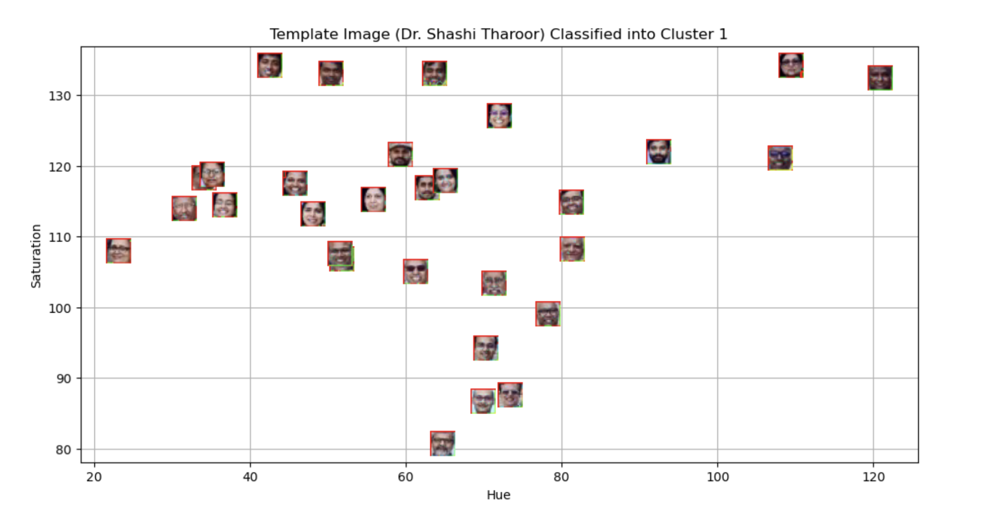

# Lab 5: Machine Learning and Pattern Recognition - Spring 2026

## Aim
The goal of this lab was to detect faces in a group photo and use unsupervised learning (K-Means clustering) to group them based on visual features like Hue and Saturation. I also tested the model by classifying a new image (Dr. Shashi Tharoor) into one of these clusters.

## Methodology
1. **Face Detection**: I used the OpenCV Haar Cascade classifier to automatically find and crop faces from `Plaksha_Faculty.jpg`.
2. **Feature Extraction**: I converted the face images to the HSV color space and calculated the average **Hue** and **Saturation** for each face.
3. **Clustering**: I used K-Means clustering with `k=2` to split the faces into two groups based on these color features.
4. **Prediction**: I processed a template image (`Dr_Shashi_Tharoor.jpg`), calculated its Hue/Saturation, and predicted which cluster it belongs to.

## Key Findings & Conclusion
* The model successfully detected most faces in the group photo.
* K-Means clustering separated the faces into two distinct groups, likely influenced by lighting and skin tone.
* The template image was successfully classified into one of the clusters, showing that the model can generalize to new data.

## Visualizations
*Below is the final scatter plot showing the two clusters and the classified template image:*

## Libraries Used
* `cv2` (OpenCV)
* `sklearn` (Scikit-learn)
* `matplotlib`
* `numpy`
